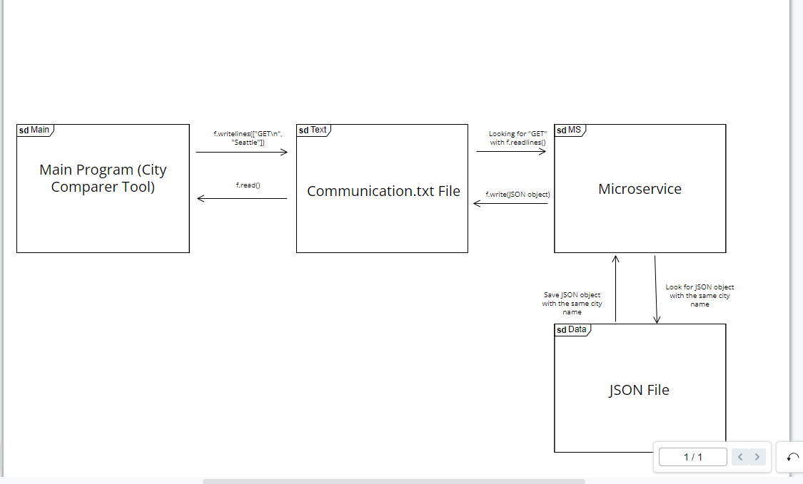

# Microservice
Microservice implementation for the city information program

Data is requested from the microservice by writing into the communication.txt file included in the microservice download. Specifically, the microservice searches for the word 'GET' on the first line of the text file and then a city name on the second line of the text file. An example call would involve opening the text file and writing into it as follows: 

f = open("communication.txt", "w")
f.writelines(["GET\n", "seattle"])

Data is received from the microservice in a similar way as it is requested - through the communication.txt file. After waiting enough time for the microservice to get data from the city database, it will write the information it gathered into the text file, which can then be read by the main program. 

